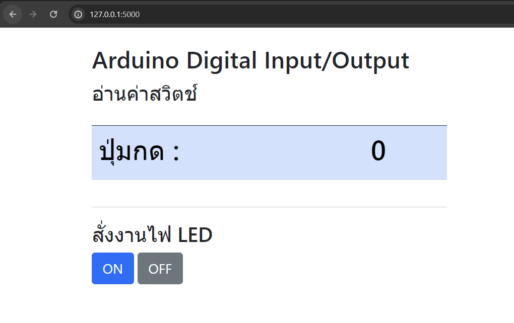

# Flask Arduino Digital Input/Output

#อุปกรณ์
|  | รายการ | จำนวน |
|----------|----------|
| 1 | Arduino UNU| 1 |
| 2 | Switch กดติด ปล่อยดับ | 1 |
| 3 | หลอด Led | 1 |
| 4 | ตัวต้านทาง 220 ohm | 1 |

# Wiring
| Arduino PIN | Component |
|----------|----------|
| 2 | LED|
| 9 | Switch |
